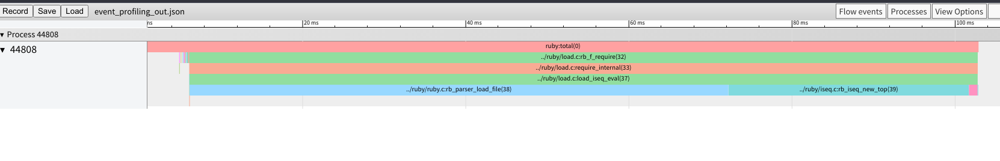
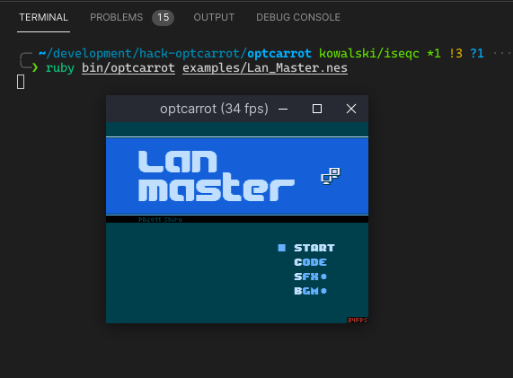

# Google Summer of Code 2021 @Ruby Language

## My Proposal

One of the most frequently used core APIs in Ruby is `Kernel#require`. It's to resolve the path of another Ruby file, read it. And since Ruby 1.9, the default runtime for Ruby is YARV which operates on bytecode, `Kernel#require` will then compile the source into bytecode and `eval` it.

Before this year Google Summer of Code, I found that on Ruby 3, `Kernel#require` is a bit slower than another similar API `Kernel#require_relative`. And after discussing with my community mentor, the inventor of YARV, Koichi Sasada, we decided to finding a way to improve overall speed of current loading mechanism.

## My work

### A new event-based profiling tool for Ruby interpreter

[PR: ruby #4673](https://github.com/ruby/ruby/pull/4673)

#### Background

Before writing the code, we had to figure out Ruby's performance profile. There're several profiling tools like `perf`, `gprof` and binary instrumentation tools like `valgrind`. But they could not meet our demand. `perf` and `gprof` are sampling-based and the part we needed to measure is too tiny to be recorded. `valgrind` takes too much memory and runs really slow.

#### What I did

We needed to know C function level behavior and performance of Ruby. So my mentor advised me to write a new event-based profiling tool for the interpreter. We are inspired by `chrome://tracing` tool and made most work done based on it.

The profiling tool has 4 parts:
- An event list to record runtime events
- An event stack to simulate the native call stack and handle long jumps
- An event serializer to generate the JSON file
- An initializer and a cleaner to setup and finalize the whole process

And there're a few difficulties to overcome:
1. Minimize profiling overhead
2. Support running in parallel
3. Handle Ruby's exceptions and long jumps

For 1 and 2, I hook Ractor creation and initialize per-ractor heap memory in advance.

For 3, I hook Ruby's internal exception handler.

Here's a simple example on how to use it

```c
// In event_profiling.h
#define USE_EVENT_PROFILING 1

// In array.c
#include "event_profiling.h"
static VALUE
rb_ary_collect(VALUE ary)
{
    RB_EVENT_PROFILING_BEGIN_DEFAULT(); // Begin Event

    long i;
    VALUE collect;

    RETURN_SIZED_ENUMERATOR(ary, 0, 0, ary_enum_length);
    collect = rb_ary_new2(RARRAY_LEN(ary));
    for (i = 0; i < RARRAY_LEN(ary); i++) {
        RB_EVENT_PROFILING_SNAPSHOT("snapshot here"); // Snapshot Event

        rb_ary_push(collect, rb_yield(RARRAY_AREF(ary, i)));
    }

    RB_EVENT_PROFILING_END_DEFAULT(); // End Event

    return collect;
}
```

And load `event_profiling_out.json` in [chrome://tracing](chrome://tracing)

With our new tool, we can illustrate a figure for `Kernel#require` on a 10000 line `def`

```ruby
def large_def
  puts 1
  puts 2
  ...
  puts 10_000
end
```



This is generated from `kernel_require.json`.

Loading the file(`rb_parser_load_file`) and compilation(`rb_iseq_new_top`) occupy most time of the whole loading process.

Other than using for this GSoC project, I've made it able to profile multiple Ractors and possible to analyze GC behavior.

### Our approach to break the bottleneck: Iseqc

[DarkKowalski/Iseqc](https://github.com/darkkowalski/iseqc)

This is a very early and experimental Ruby Gem used to pre-compile YARV Instruction Sequence and do fast loading.

#### Background

There're some other mature projects like [ko1/yomikomu](https://github.com/ko1/yomikomu) and [Shopify/bootsnap](https://github.com/Shopify/bootsnap). We do not want to reinvent it but make something different.

Bootsnap enhanced Ruby interpreter's YARV Instruction Sequence(iseq) loading mechanism with C extension, making it possible to cache
iseq in local directories indexed by file name hash.

Other than caching, we have larger goals:
- Pre-compilation iseq
- Link iseqs from different sources into a single binary file
- Reorder the binary and eliminate duplicate parts
- Use `mmap` to load, sharing one iseq binary between different Ruby interpreter processes

#### What I did

I've crafted a very simple version without iseq binary reordering but the benchmark can tell it does help. (See GitHub for the file format and how to benchmark: [DarkKowalski/Iseqc](https://github.com/darkkowalski/iseqc))

I prepared 3 cases for the benchmark(See [cases](https://github.com/DarkKowalski/iseqc/blob/master/bench/gen_cases.rb)):

- 10000 line `def` x 10
- 10000 line `class` x 10
- 1kb literal `String` x 10

Run all cases 100 times and measure the performance with `Benchmark#bmbm`

```
                         user     system      total        real
Kernel#require       0.001596   0.000000   0.001596 (  0.001600) baseline
Bootsnap#require     0.000092   0.000000   0.000092 (  0.000091)
Iseqc#require_iseq   0.000268   0.000000   0.000268 (  0.000268) 5  times faster

Kernel#load         21.070341   0.183137  21.253478 ( 21.273447) baseline
Bootsnap#load        1.253958   0.076384   1.330342 (  1.336012)
Iseqc#load_iseq      1.223862   0.000000   1.223862 (  1.224858) 16 times faster
```

It's currently slower than bootsnap on `require` but we should be able to overcome it once we replace more Ruby code with C extension.

I have tested Iseqc on this modified [optcarrot](https://github.com/darkkowalski/optcarrot/tree/kowalski/iseqc).

This `pack.rb` will compile and link all `.rb` files under the `lib` directory and outputs a `optcarrot.rpk`

```ruby
require 'iseqc'
Iseqc::Pack.pack('optcarrot.rpk', 'lib')
```

Then we can use such code to load files from it
```ruby
module Optcarrot
  PKG = Iseqc::Unpack.unpack('optcarrot.rpk')
end

Optcarrot::PKG.require "optcarrot/nes.rb.rbc"
```



#### Unfinished work

There're still some unfinished work:
- Analyze the linked iseq binary and apply optimizations
- Support memory sharing between processes

I can support memory sharing later but need more time to find a way to optimize the iseq binary.

And other features we could consider:
- Support `require 'file', from: 'package'` in `Kernel` module
- Support distinguishing internal `require_relative` inside a package

## Conclusion

For this year Google Summer of Code, we tried to analyze and improve the overall performance of Ruby current loading mechanism `Kernel#require`.

We made a new event-based profiling tool that helps us to know more runtime performance details of Ruby. And Ruby maintainers are going to merge it as a debugging/profiling facility.

We had a try at `pre-compile -> link(possible to apply reordering and optimization) -> load with mmap` approach to improve the performance. The benchmark can tell it does help.

For now it's not that clear how to apply link time optimization and reordering for YARV Instruction Sequence. But it's a nice idea and I'd like to spend more time on it after this GSoC.

Thank Ruby community mentors, especially Koichi Sasada([ko1](https://github.com/ko1)) who helped me a lot. And thank Google for this great Summer of Code.
